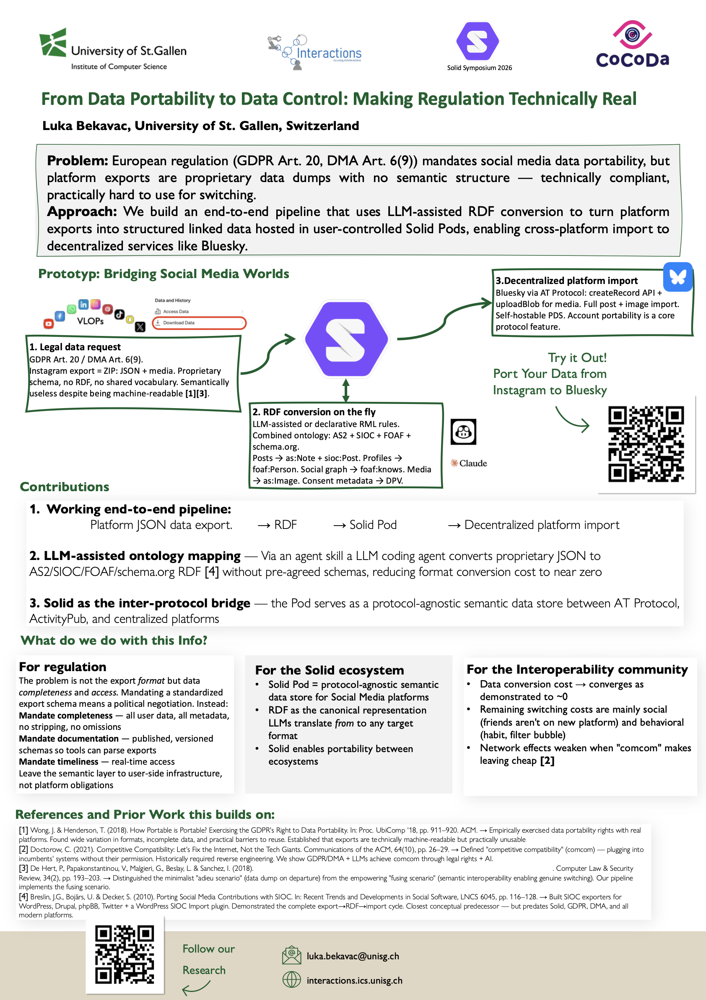

# BridgingWorlds

[](SolidSymp26LukaBekavac.pdf)

Take your Instagram data export, convert the public bits to standard RDF, store it in your own [Solid Pod](https://solidproject.org/), and re-publish it to [Bluesky](https://bsky.app). One pipeline, one set of commands.

Reference provider: **Instagram**. Adding TikTok / Facebook / X / YouTube / LinkedIn / Threads / etc. is a structured 3-PR workflow guided by [.claude/skills/add-vlop-provider/SKILL.md](.claude/skills/add-vlop-provider/SKILL.md).

---

## Quickstart: Instagram → Pod → Bluesky

End-to-end in ~20 minutes once your accounts are set up. 

### Prerequisites

- **Python ≥ 3.11**, **Node.js ≥ 20**, macOS or Linux (Windows via WSL).
- ~2 GB free disk per Instagram archive.
- A Solid Pod (free at https://solidcommunity.net).
- A Bluesky account.
- Your Instagram data export.

### Step 1 — Request your Instagram export

1. Instagram → **Settings → Accounts Center → Your information and permissions → Download your information**.
2. Pick **JSON format**, **All time**, **All data**.
3. Wait for the email (~15 min). Download the ZIP. Drop it into the project root.

### Step 2 — Create a Solid Pod (5 min, free)

1. https://solidcommunity.net → **Sign up**.
2. Note your Pod URL: `https://YOURNAME.solidcommunity.net/`.
3. Open https://solidcommunity.net/.account/ → **Account → Credentials tokens → Create token**. Name it `bridgingworlds-cli`.
4. **Copy the `client_id` and `client_secret` immediately** — they are shown once.

### Step 3 — Create a Bluesky app password (1 min)

1. https://bsky.app → **Settings → Privacy and security → App Passwords → Add App Password**.
2. Copy the `xxxx-xxxx-xxxx-xxxx` value (shown once).
3. Note your handle (e.g. `yourname.bsky.social` — **no leading `@`**).

### Step 4 — Install

```bash
git clone https://github.com/Interactions-HSG/BridgingWorlds
cd BridgingWorlds

# Python
python -m venv .venv && source .venv/bin/activate
pip install -e '.[dev]'

# TypeScript
npm install
npm run build
```

### Step 5 — Configure secrets

```bash
cp .env.example .env
```

Edit `.env`:

```bash
SOLID_POD_URL=https://YOURNAME.solidcommunity.net/
SOLID_IDP=https://solidcommunity.net/
SOLID_CLIENT_ID=<paste from Step 2>
SOLID_CLIENT_SECRET=<paste from Step 2>

BLUESKY_HANDLE=yourname.bsky.social   # no leading @, no spaces
BLUESKY_APP_PASSWORD=xxxx-xxxx-xxxx-xxxx
```

### Step 6 — Convert your archive to RDF

```bash
bridging run instagram-yourname-2026-04-07-XXXX.zip --username yourname
```

Produces:
- `output/normalized/<type>.json` — clean dicts, **stays local**
- `output/rdf/<type>.ttl` — public-only RDF (profile, posts, followers, following, stories)
- `output/rdf/media_manifest.json` — media file index for the upload step

You'll see something like:
```
Conversion complete (public data only):
  profile: 19 triples
  posts: 412 triples
  followers: 247 triples
  following: 198 triples
  stories: 88 triples
  Total: 964 triples
  Not converted (private or aggregated activity log): likes, comments, messages, saved, searches
```

### Step 7 — Upload to your Solid Pod

```bash
# Upload all RDF + the photos from your posts (skip videos and stories — much smaller)
node dist/index.js store --media-categories posts --media-types image
```

Or, if you've already uploaded the RDF and just want to add more media later:

```bash
node dist/index.js store --skip-rdf --media-categories posts --media-types image
```

Verify in your browser (logged in as your Pod owner):
- `https://YOURNAME.solidcommunity.net/profile/card`
- `https://YOURNAME.solidcommunity.net/social/posts/posts.ttl`
- `https://YOURNAME.solidcommunity.net/social/media/images/`

### Step 8 — Dry-run the Bluesky export

**Always do this first.** No posts go up; the exporter writes one JSON per post to `output/export/bluesky/`.

```bash
node dist/index.js export --target bluesky --source pod --dry-run
```

Inspect a few:

```bash
ls output/export/bluesky/ | wc -l         # post count
cat output/export/bluesky/post_1.json     # caption + image embed
```

Look for: caption text correct, `embed.images[]` present where you expect a photo, no truncation surprises.

### Step 9 — Real Bluesky post

Make sure [config/default.yaml](config/default.yaml) has `dry_run: false` (it does by default in this repo). Then:

```bash
node dist/index.js export --target bluesky --source pod
```

Expected: ~one post per second (0.5 s rate-limit cushion + image upload). For 38 posts this takes ~1 min.

**Strong recommendation:** test against a throwaway Bluesky handle first. The exporter has no resume / dedupe — re-running posts everything again.

### Step 10 — Federate to Mastodon via ActivityPods (optional)

[ActivityPods](https://activitypods.org) pods are Solid Pods that natively speak ActivityPub — every pod owner is a Fediverse actor with an inbox/outbox. BridgingWorlds publishes your posts to that actor's outbox, so Mastodon users can follow you and see them. **The data stays hosted on your Solid Pod:** the federated notes reference your photos by their public Pod URLs — nothing is re-uploaded to a Mastodon server.

1. Create a pod at an ActivityPods provider (e.g. https://activitypods.org → "Get a Pod").
2. Add to `.env`:

```bash
ACTIVITYPODS_BASE_URL=https://mypod.store
ACTIVITYPODS_USERNAME=yourname
ACTIVITYPODS_PASSWORD=your-password
```

3. Dry-run first — writes one `Create` activity JSON per post to `output/export/activitypods/`, touches nothing remote:

```bash
node dist/index.js export --target activitypods --source pod --dry-run
```

4. Set `dry_run: false` under `export.mastodon.activitypods` in [config/default.yaml](config/default.yaml) (just dropping the `--dry-run` flag is not enough — the config default is dry), then federate:

```bash
node dist/index.js export --target activitypods --source pod
```

Your posts are now followable at `@yourname@mypod.store` from any Mastodon instance. Same caveat as Bluesky: no resume / dedupe — re-running publishes everything again.

---

## Troubleshooting (the gotchas you'll hit)

| Symptom | Fix |
|---|---|
| `outgoing request timed out after 3500ms` on Pod auth | Already retried up to 4× with backoff. If it still fails, your IDP is down — wait or use `--source local`. |
| `XRPCError: Invalid identifier or password` from Bluesky | Almost always one of: leading `@` on the handle, used main password instead of an app password, or stray whitespace. Bluesky rate-limits failed logins to **10/day per IP** — fix `.env` before retrying or you'll be locked out. |
| `ratelimit-remaining` going down on each retry | Stop retrying. Verify `.env` first — see the Bluesky row above. |
| Media upload very slow | Use `--media-categories posts --media-types image` to upload only post photos (~10 MB) instead of all 800+ MB. |
| Posts go up with no images | Image > 1 MB (Bluesky's hard limit) or the `LocalMediaResolver` couldn't find the file. Pass `--media-base path/to/instagram-yourname-...` to override auto-detect. |

---

## Useful commands reference

```bash
# Convert
bridging run <archive.zip> --username <handle>

# Pod — uploads
node dist/index.js store                                    # all RDF + all media
node dist/index.js store --skip-rdf                         # media only
node dist/index.js store --skip-media                       # RDF only
node dist/index.js store --media-categories posts --media-types image
node dist/index.js cleanup                                  # delete retired private categories from Pod

# Bluesky — dry-run then real
node dist/index.js export --target bluesky --source local --dry-run
node dist/index.js export --target bluesky --source pod

# Mastodon — live federation via ActivityPods (data stays on your Solid Pod)
node dist/index.js export --target activitypods --source pod --dry-run
node dist/index.js export --target activitypods --source pod

# Mastodon / ActivityPub (static JSON + follow CSV, no federation)
node dist/index.js export --target mastodon

# Extract structure-only JSON Schemas from a raw export (genson, deterministic —
# the first step when adding a new provider; contains no data values)
bridging schema <archive.zip> --provider <name>

# Metrics for the paper
bridging metrics <archive.zip> --output metrics.json
```

---

# Further info: how this works

## What this does

```
Instagram export.zip
        │
        ▼ (Python)  ingest    ─ extract, fix encoding, normalize to JSON
        ▼ (Python)  convert   ─ map to RDF (ActivityStreams 2.0 / SIOC / FOAF / schema.org)
        ▼ (TS)      store     ─ upload Turtle + photos to your Solid Pod
        ▼ (TS)      export    ─ re-publish from Pod to Bluesky and to Mastodon via ActivityPods
```

| Stage | Code | What it does |
|---|---|---|
| ingest | [src/python/.../ingest/](src/python/bridging_worlds/ingest/) | Parse the export ZIP, fix Instagram's broken UTF-8 encoding, normalize to clean dicts |
| convert | [src/python/.../convert/](src/python/bridging_worlds/convert/) | Map normalized dicts to AS2/SIOC/FOAF/schema.org RDF Turtle |
| store | [src/ts/store/](src/ts/store/) | Auth to a Solid Pod, create containers, PUT Turtle + media |
| export | [src/ts/export/](src/ts/export/) | Read RDF (from disk or Pod), post to Bluesky, federate to Mastodon via ActivityPods |

## Privacy: public data only

**Hard rule, enforced in code:** only data publicly visible on Instagram and not an aggregated activity log of yours is converted to RDF. Everything else is dropped before it reaches the Pod or Bluesky.

| Converted | Dropped |
|---|---|
| Posts, reels (caption + photos, no EXIF GPS) | DMs |
| Stories | Saved / bookmarks |
| Followers / following lists | Search history |
| Profile: username, bio, profile photo | "Liked posts" lists |
|  | Your full comment history (each comment is public on its source post, but the aggregated cross-post list is an activity log) |
|  | Profile PII: email, phone, DOB, gender |
|  | EXIF GPS coordinates |

Enforced at exactly one place — the `builders` dict in [convert/graph_builder.py::convert_all](src/python/bridging_worlds/convert/graph_builder.py). Excluded categories have no schema model, no normalizer, and no graph builder, so they cannot leak.

## Configuration

[config/default.yaml](config/default.yaml) controls every stage. Most useful knobs:

```yaml
store:
  container_base: /social/      # where on your Pod everything lands
  upload_media: true
  batch_size: 50
export:
  bluesky:
    dry_run: false              # flip to true to never post live
    rate_limit_delay: 0.5       # seconds between posts
    max_text_length: 300        # Bluesky's lexicon limit
```

Pass `--config path/to/other.yaml` to override.

## Adding a new VLOP

To add TikTok, Facebook, X, YouTube, LinkedIn, Threads, Snapchat, Reddit, or Pinterest, follow the **[add-vlop-provider skill](.claude/skills/add-vlop-provider/SKILL.md)**.

It's a Claude Code skill — open this repo in Claude Code and say *"add support for the TikTok export"*. Claude auto-loads the skill and walks the work in **three sequential PRs**:

1. **PR 1** — Schema, fixtures, parser. `bridging schema` extracts structure-only JSON Schemas from the real archive deterministically (genson — **the model never sees the data, only the schemas**). Pydantic models, extractor, and parser are then written from the schemas alone.
2. **PR 2** — Normalizer. Implement `normalize_<type>()` per public content type so the output dicts match the contract that [convert/graph_builder.py](src/python/bridging_worlds/convert/graph_builder.py) already expects — again authored from the schemas, not the data.
3. **PR 3** — Convert + end-to-end test. The (unchanged) RDF builder produces Turtle. Bluesky export dry-runs successfully.

The skill enforces the public-only privacy rule: any new content type needs documented evidence of public visibility on the source platform before a builder is added.

You can also follow the skill manually without Claude — it's a self-contained spec.

### What changes per new provider

- **New:** `src/python/bridging_worlds/ingest/<provider>/{extractor,parser,schema,normalizer}.py`
- **Edited (small):** [src/python/bridging_worlds/cli.py](src/python/bridging_worlds/cli.py), [config/default.yaml](config/default.yaml)
- **Refactor (one-time, on the second provider):** move existing Instagram code into `ingest/instagram/`
- The store and export stages should not need changes — they consume the provider-agnostic RDF.

## Repo layout

```
.
├── config/default.yaml              # pipeline knobs
├── src/
│   ├── python/bridging_worlds/
│   │   ├── cli.py                   # `bridging` entry point
│   │   ├── ingest/                  # per-provider; currently Instagram-shaped
│   │   ├── convert/                 # public-only RDF builder
│   │   └── metrics/
│   └── ts/
│       ├── index.ts                 # `node dist/index.js` entry
│       ├── store/                   # Solid Pod upload (incl. cleanup command)
│       └── export/                  # Bluesky / ActivityPub / CSV
├── .claude/skills/add-vlop-provider/SKILL.md
├── package.json                     # TS deps + scripts
├── pyproject.toml                   # Python deps + scripts
├── .env.example
├── .gitignore
└── README.md
```

`output/` and your archive directory are gitignored.

## Development

```bash
# Python
pytest
ruff check src/python/

# TypeScript
npm run build
npm test
```

## License & status

Research prototype. Expect breaking changes between provider versions; VLOPs alter export formats without notice. The add-vlop-provider skill is the recovery path when they do.
